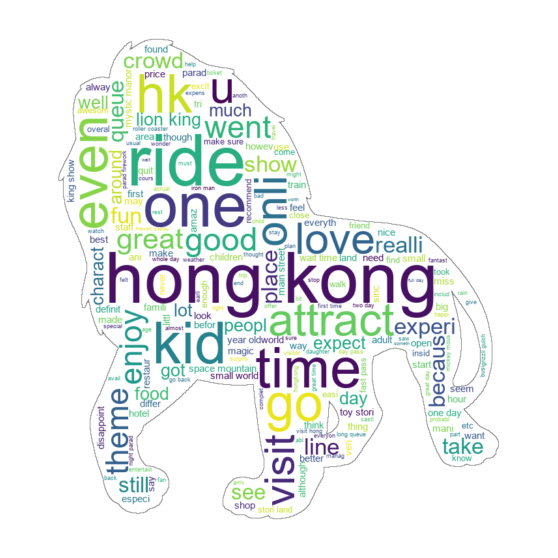
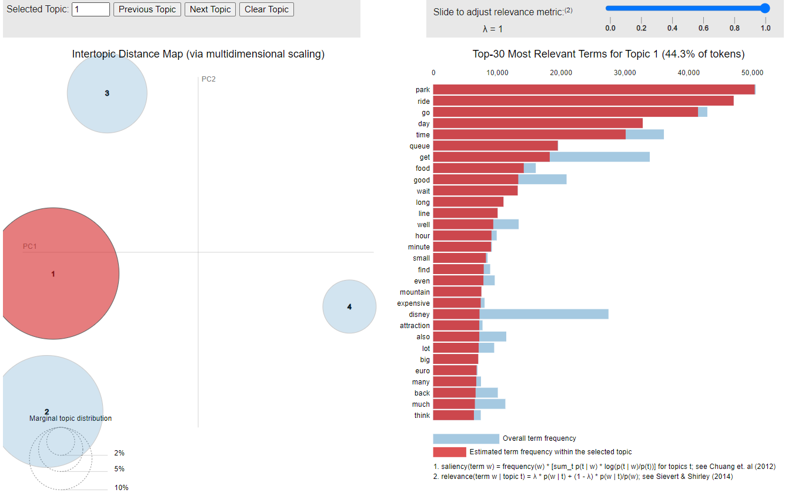
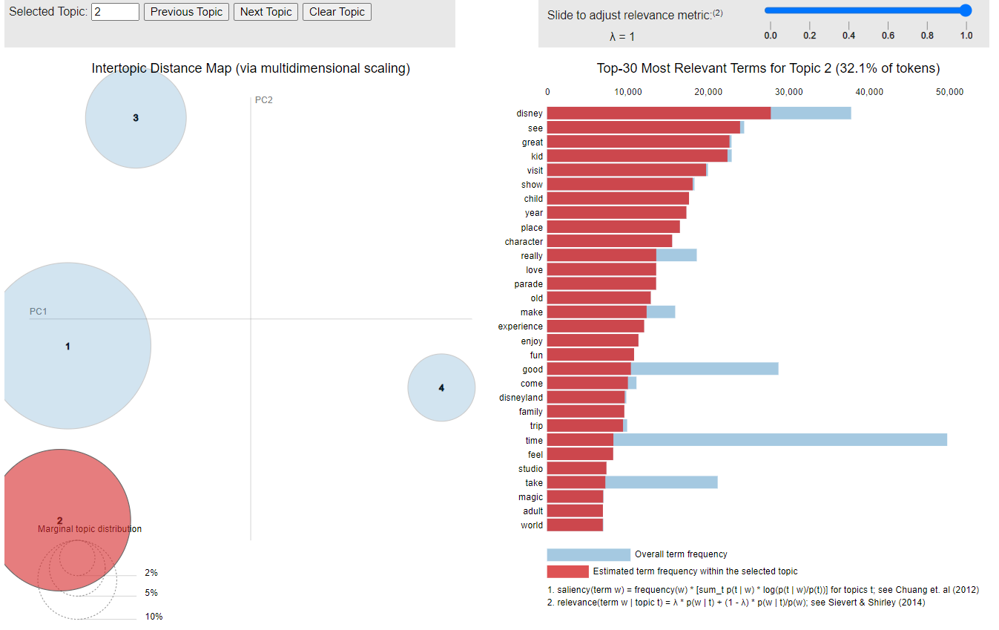

Analysing Disneyland Reviews with NLP

## EDA, Word Clouds, Sentiment Analysis, Emotion Detection, Collocation, and Topic Modelling

# Project Goal:

Though this NLP study, I wish to identify customer sentiment regarding Disney
Land experience based on reviews by visitors. The reviews are from three
locations of Disney Land at California, Paris, and Hong Kong.

I used textblob, vader, nltk, NRCLex, spacy, genism libraries in python to carry
out sentiment analysis, emotion detection, and n-gram associations. I have also
done topic modelling using which we can Identify visitor pain points and improve
park experience.

Inspiration: [References1!..]
(https://towardsdatascience.com/analyzing-disneyland-reviews-b916b6dcccf4)

# Dataset:

The dataset is found in Kaggle containing 42,000 reviews from TripAdvisor about
three Disneyland branch locations: California, Paris, Hong Kong.

There are 19,406 reviews about
California, 13,630 about Paris, and 9,620 about Hong Kong. Data variables
include Review_ID, Rating, Year_Month, Reviewer_Location, Review_Text, and
Disneyland_Branch.

# Exploratory Data Analysis:

 First step is exploratory data
analysis (EDA) to get an idea of average ratings across all locations, how the
ratings changed over time and where our visitors are from.

The ratings of DL in California have been decreasing over years, ratings of DL
Hong-Kong have been significantly improving, avg Ratings for DL Paris have
improved from 2014 but after 2017 there is a sudden decrease.

Visitor nationality is dependent on location — for example most of the Hong Kong
visitors are from countries nearby (i.e. Australia, India, Philippines), most of
Paris’s visitors are from the United Kingdom, and many of California’s visitors
are from the United States.

**Word Clouds:**

Here are some interesting word
clouds to get a general idea of what visitors are talking about in their reviews
on Disney Land Visit. Only English reviews are considered also duplicate reviews
are removed.

**Word cloud for reviews for Disneyland in California**

****

**Word cloud for reviews for Disneyland in Paris**

**Word cloud for reviews for Disneyland in Hong Kong**

In general, the reviews from all three locations mention fast passes, lines or
queues, visitor demographic, rides and attractions.

**Word cloud for reviews for all locations of Disneyland**

**Sentiment Analysis**

Sentiment analysis is basically the process of determining the attitude or the
emotion of the writer, i.e., whether it is positive or negative or neutral.

In this section I will take a closer look into the reviews to reveal visitor
sentiment. For this step, I used three methods TextBlob, Vader and NLTK.

### Sentiment Analysis using TextBlob:

The sentiment function of
textblob returns two properties, polarity, and subjectivity.

#### What is Sentiment Polarity

-   It is the expression that determines the sentimental aspect of an opinion.
    In textual data, the result of sentiment analysis can be determined for each
    entity in the sentence, document or sentence.

-   Polarity is float which lies in the range of [-1,1] where 1 means positive
    statement and -1 means a negative statement.

#### What is Sentiment Subjectivity

-   Subjectivity quantifies the amount of personal opinion and factual
    information contained in the text. The higher subjectivity means that the
    text contains personal opinion rather than factual information.

-   Subjectivity is also a float
    which lies in the range of [0,1].

### VADER Sentiment Analysis:

VADER (Valence Aware Dictionary and sentiment Reasoner) is a lexicon and
rule-based sentiment analysis tool that is specifically attuned to sentiments
expressed in social media.  
VADER uses a combination of A sentiment lexicon is a list of lexical features
(e.g., words) which are generally labelled according to their semantic
orientation as either positive or negative.  
VADER not only talks about the Positivity and Negativity score but also tells us
about how positive or negative a sentiment is.

The Lexicon-based approach uses pre-prepared sentiment lexicon to score a
document by aggregating the sentiment scores of all the words in the document.
The pre-prepared sentiment lexicon should contain a word and corresponding
sentiment score to it.

#### This method uses compound score to assign sentiment “positive” or “negative”.

The Compound score is a metric that calculates the sum of all the lexicon
ratings which have been normalized between -1(most extreme negative) and +1
(most extreme positive).

-   positive sentiment: (compound score \>= 0.65)

-   neutral sentiment: (compound score \>=0.4) and (compound score \< 0.65)

-   negative sentiment:
    (compound score \<0.4)

### Using NLTK’s Pre-Trained Sentiment Analyzer

NLTK already has a built-in, pretrained sentiment analyser called VADER (Valence
Aware Dictionary and sentiment Reasoner).

Since VADER is pretrained, we can get results more quickly than with many other
analysers. However, VADER is best suited for language used in social media, like
short sentences with some slang and abbreviations. It’s less accurate when
rating longer, structured sentences, but it’s often a good launching point.

To use VADER, first we have to create an instance of
nltk.sentiment.SentimentIntensityAnalyzer, then use .polarity_scores() on a raw
string. Now using the. polarity_scores() function of SentimentIntensityAnalyzer
instance we can classify the reviews.

#### This method uses compound score to assign sentiment “positive” or “negative”.

-   positive sentiment: (compound score \> 0)

-   neutral sentiment: (compound score ==0)

-   negative sentiment: (compound score \< 0)

### 

### 

### 

### Assigning sentiment based on ratings:

Last but not the least is assigning sentiment based on the rating.

-   positive sentiment: (rating \>=4)

-   neutral sentiment: (rating==3)

-   negative sentiment: (rating
    \<3)

# Emotion Detection

To assign emotions I used NRCLex, which measures emotional affect based on text.
Emotions like positive, negative, anticipation, trust, fear, surprise, anger,
sadness, joy, and disgust are assigned to the text.

Out of the three locations, Hong Kong is the only location that did not feel
“disgust.”

Overall, all three parks have a high frequency of “positive” emotion. However,
we have to take a closer look at reviews associated to negative emotions (anger,
fear, negative, disgust, sadness) so that we can have an idea of why some
visitors had an unpleasant park experience.

Here are some interesting reviews where emotions were classified as “disgust” or
“negative”:

### Customer service in Hong Kong:

this is definitely one of the worst that we have encountered...we did met a
quite a handful staff with typical arrogant attitude that we faced in explorer
hotel. Not sure if the staff was train to put on such arrogant attitude or
what....Will never ever visit this horrible place again.

### Rides and Park maintenance in California:

The park is in disrepair, rides breaking down continuously. There are an
unacceptable number of rides that are closed for repairs also. There is no
reason for this to happen when you are paying close to 100 per day just to enter
the park. Restaurants are awful, prices are disgusting, customer service is
non-existent...Would never return.

### Park maintenance in Paris:

If you enjoy queuing, pushing your way through crowds and stinking toilets this
is the place for you. My complaints are endless ...The park cant cope with the
amount of people. ..queue for 2.. bags x-rayed.... check your tickets...book
your lunch time. Go for your meal... In this restaurant serving approx. 100
people there is 1 toilet and 1 sink in the ladies and gents it stinks ...floor
was covered in water from the overflowing blocked toilets...4 major rides were
closed ...overall the experience is stressful and not one i would recommend,
there was no magic for us as it was ruined by a park that is obviously cannot
cope....

### Hotel Stay in Paris:

I would strongly advise against staying at Disneyland Hotels. Spent a week at
tge Seqouia Lodge. The smell of cannabis was overwhelming. After several
complaints and threats to announce it to other guests, the security staff and
manager begrudgingly attended and agreed, but said there was nothing they could
do. Was offered same room elsewhere rather than them tackling a noticeable drug
issue. Very poor service and staff were far from satisfactory. The park itself
was tired to say the least.

Using sentiment and emotion together can help Disney find areas of customer
dissatisfaction and why they are dissatisfied. Then, this information can be
used to make the appropriate changes necessary to enhance visitor experience.

# Using n grams to find word patterns

Bigram Association — identifying two words that co-occur frequently to gain more
insight about review context. These are more meaningful if adjectives and nouns
alone are considered:

The most frequent bigrams mention popular attractions, type of ticket used (day
pass, fast pass), characters (cast member, Indiana jones, peter pan) and wait
time.

Trigram Association — identifying three words that co-occur frequently to gain
more insight on review context. Trigrams may give us more information on what
visitors do in the theme parks. Again, only adjectives and nouns are considered
to give us meaningful context.

Trigram show a lot of rides! which rides/attractions visitors went to, what kind
of tickets they purchased and experience.

# Find reviews where ngram occurs

Using collocation identification
and further analysing visitor sentiment on toy story land, we can find the
emotion on reviews.

# Topic Modelling

Topic modelling is a technique to extract the underlying topics from large
volumes of text.

We can use topic modelling to extract keywords used in reviews to help Disney
identify specific issues that concern park visitors. We can build a dictionary
and train our topic model using an unsupervised learning algorithm, LDA (Latent
Dirichlet Allocation) to uncover hidden patterns in the text.

The ideal number of topics is 4. This gave a coherence score of 0.38 and
perplexity score of -6.94. Applying this k value, we obtain the top words in
each topic:

From our topic model, we were able to obtain top keywords from each topic:

-   44.3% of tokens about park, rides, queue and waiting.

-   32.1% of tokens about positive and fun family park experience.

-   16.3% of tokens about fast passes, restaurant, hotels and bookings.

-   7.3% of tokens about customer service, maintenance, staff and behaviour

    

